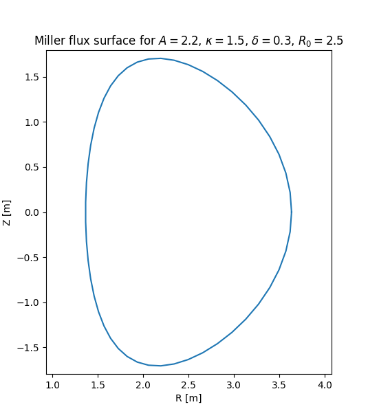

<a rel="license" href="http://creativecommons.org/licenses/by-sa/4.0/">

</a>
<br />This work is licensed under a <a rel="license"
href="http://creativecommons.org/licenses/by-sa/4.0/">Creative Commons
Attribution-ShareAlike 4.0 International License</a>.


Automate Your PhD
=================

This project will take you through turning a script with hardcoded
parameters into a reusable package that is easier to use, more
flexible, and can be used to automate your research.

Requirements
------------

We'll be using [uv](https://docs.astral.sh/uv/) to manage our Python
environment. Follow the installation instructions there and check that
you can run:

```console
$ uv --version
uv 0.5.7
```

You might have a more recent version, that's fine.

You'll also need a moderate amount of Python knowledge. While this
tutorial uses Python, many of the techniques we'll go through are more
broadly applicable to most other programming languages.

You'll also need to be able to use `git` for version control.

Overview
--------

Start by forking this project on GitHub, and cloning it locally. Then
work through the exercises in each of the subdirectories:

0. [Setup](0_setup)
1. [Reusable module](1_resuable_module)
2. [Packaging](2_packaging)
3. [Input](3_inputs)
4. [Testing](4_testing)

You might find it easiest to view the exercises by looking at the
`README.md` file in each directory on GitHub, rather than locally.

Each step comes with a set of tests that you should run after each
exercise. The tests will start off all failing, and successfully
completing each exercise will make more and more tests pass. You can
use this to assess your progress through the whole tutorial.

You should regularly commit your work, at least after completing each
exercise, possibly more frequently.

There are some **bonus** and **advanced** exercises throughout this
tutorial. Bonus exercises are good to go through if you find you have
some extra time during the session, and are about techniques that are
generally useful to most people. Advanced exercises, on the other
hand, are usually a bit more specialist, or require a bit more time
and/or research to implement. They are good next steps for the
interested learner to look into after the session.

Next Steps
----------

We can't cover everything in this tutorial, but there is always
something more to learn. After applying the techniques you've learnt
here to your own projects, you might like to investigate the following
tools and resources:

- automate running tests with [GitHub actions][actions]
    - This more generally falls under the names "Continuous Integration",
      "Continuous Development", or "CI/CD"
    - You can use CI to automate all sorts of things, such as
      running formatters and linters, publishing packages, building
      containers, and so on
- self-describing output files using [netCDF][netcdf] or [HDF5][hdf5]
    - These file formats are portable across systems, and can help
      both structure and describe your data through labels with things
      like units or plain language descriptions
    - It's useful to store things like the exact input parameters, the
      version of the code used, when the code was run, and other
      metadata
- better analysis using [Pandas][pandas] or [xarray][xarray]
    - Pandas works very well with tabular data
    - Xarray is designed for labelled, multi-dimensional data
- documentation using [Sphinx][sphinx] and [ReadTheDocs][rtd]
    - Sphinx uses ReStructuredText (a kind of text markup, like LaTeX
      or HTML) to make documentation websites from source code
    - Sphinx can also automatically pull out docstrings from Python
      packages to make API documentation (there are plugins for other
      languages too)
    - ReadTheDocs hosts and automatically generates websites using
      Sphinx (the [xarray][xarray] docs, for instance, are written in
      Sphinx and built with ReadTheDocs)

For a longer and more in-depth course on packaging Python please see
[this Software Carpentries incubator course][python_packaging], which
includes more details on the project metadata, publishing packages on
PyPI, and the sometimes confusing history behind python packages. This
course was written by Liam Pattinson, another member of
[PlasmaFAIR][plasmafair].

[actions]: https://docs.github.com/en/actions
[netcdf]: https://www.unidata.ucar.edu/software/netcdf/
[hdf5]: https://www.hdfgroup.org/solutions/hdf5/
[pandas]: https://pandas.pydata.org
[xarray]: https://docs.xarray.dev/en/stable/
[sphinx]: https://www.sphinx-doc.org/en/master/
[rtd]: https://readthedocs.org
[python_packaging]: https://carpentries-incubator.github.io/python_packaging/index.html
[plasmafair]: https://plasmafair.github.io

Background: Miller Geometry
===========================

A local equilibrium of the magnetic field of a tokamak can be
represented with the so-called Miller parameterisation, defined in
[Phys. Plasmas, Vol. 5, No. 4, April 1998 Miller et al.][1]:


```math
\begin{align}
R_s(r, \theta) &= R_0 + r \cos[\theta + (\sin^{-1}\delta) \sin(\theta)] \\
Z_s(r, \theta) &= r \kappa \sin(\theta)
\end{align}
```

where $`R_s, Z_s`$ are the major radius and vertical coordinate of the
flux surface, $`R_0`$ is the major radius of the magnetic axis, $`A`$
is the aspect ratio, $`r = R_0 / A`$ is the minor radius of the flux
surface, $`\theta`$ is the geometric poloidal angle, $`\kappa`$ is the
elongation, and $`delta`$ is the triangularity.

The three parameters, $`A, \kappa, \delta`$ give a nice, simple
representation of a single flux surface. To be useful in practice, for
example in order to calculate the poloidal magnetic field, we actually
need a few more parameters, but as this is just a toy to demonstrate
software development practices, we won't concern ourselves with them
here.



[1]: https://doi.org/10.1063/1.872666
